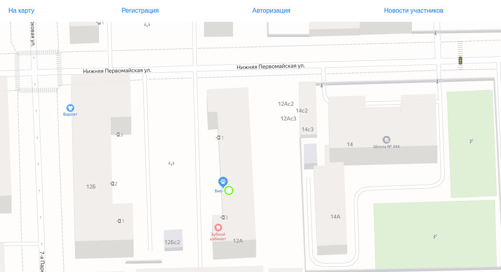

# Сorona - проект для заболевших коронавирусом

Данный проект позволяет определять местонахождение больных коронавирусом  и поддерживать с ними связь.
Адрес, введённый при регистрации указывается на карте. Пользователь может написать discord-боту о том, что он заболел,
и точка на карте станет красной. При сообщении о том, что пользователь выздоровел, точка вновь окрасится в зелёный.
Также на данном сайте авторизованные пользователи могут публиковать новости о своём самочувствии и т. д.
В дальнейшем проект можно будет улучшить добавив различные функции (вызов скорой, связь со службами доставки и т. д.), а так же
сделав общение между пользователями более удобным.

**app.py** - сервер Flask

**bot_server** - сервер бота discord

Файл видео-презентации проекта:
